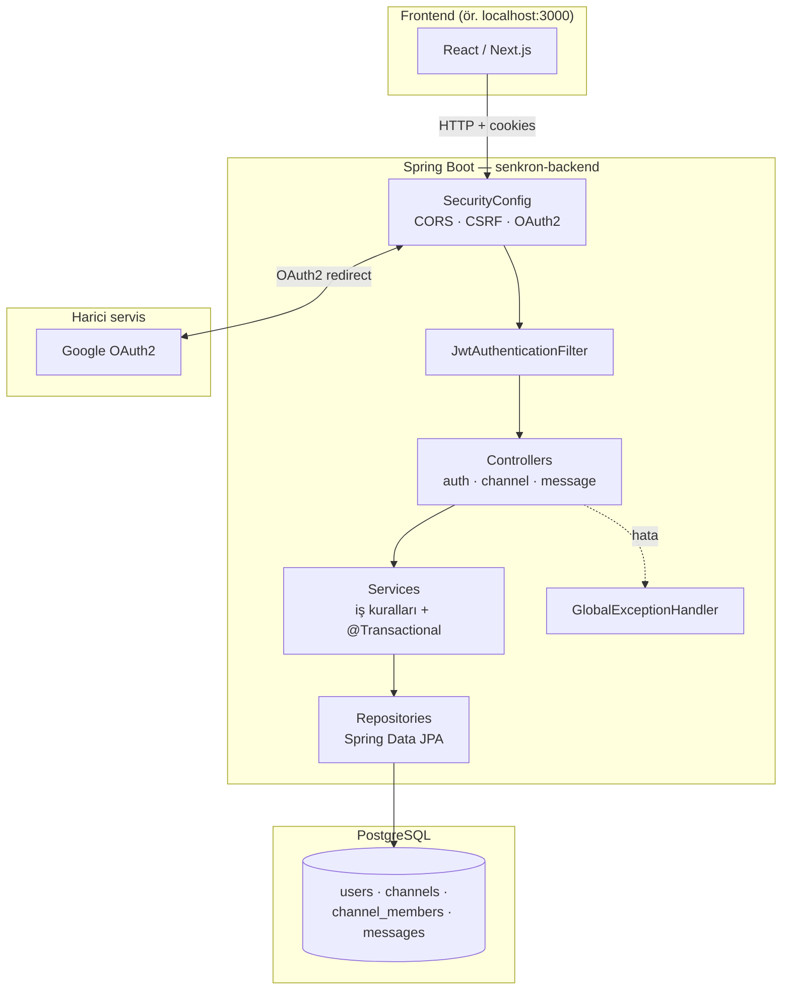
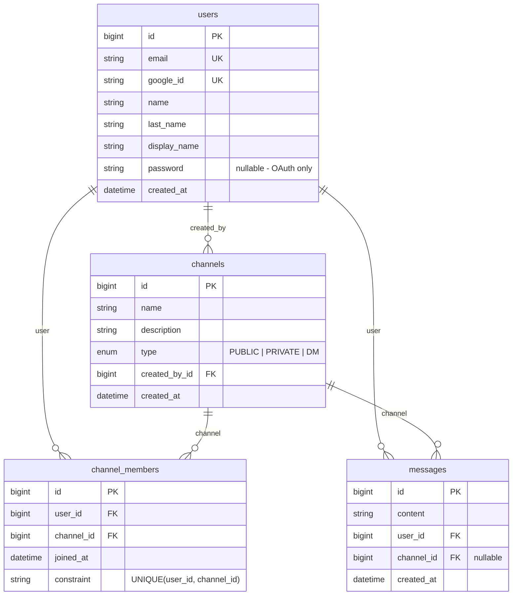
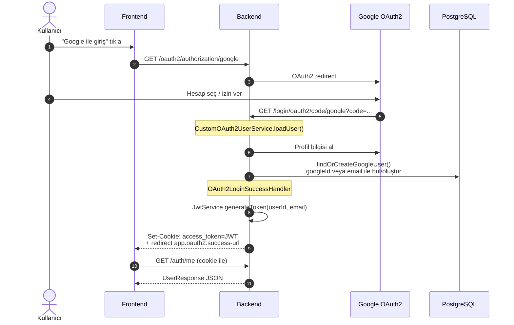
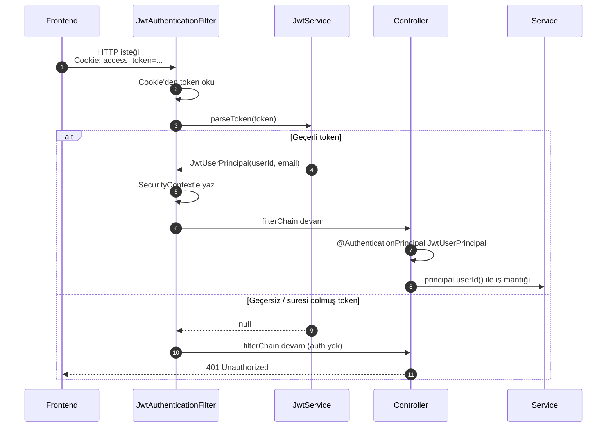
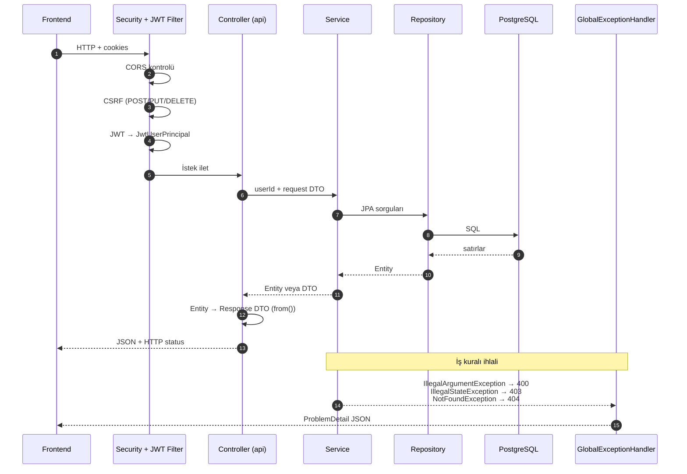
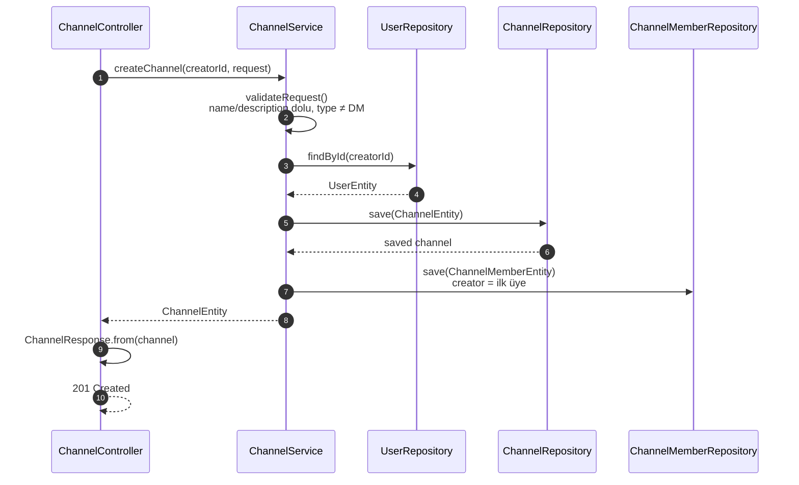
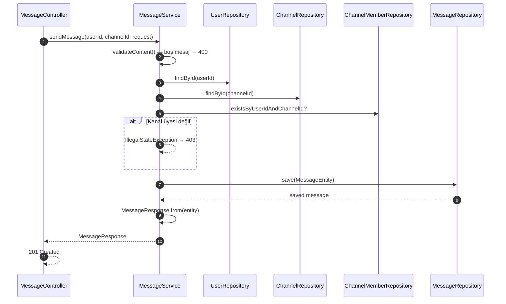

# senkron-backend

Slack benzeri sohbet uygulaması **Senkron**'un Spring Boot REST API backend'i.

Bu doküman hem **yerel kurulum** hem de **mimari / istek akışları** için tek kaynak. Projeye yeni katılan geliştiriciler (junior) önce buradan başlayabilir. İngilizce teknik referans için bkz. [`ARCH.md`](ARCH.md).

---

## Prerequisites

- **Java 21**
- **Docker Desktop** (for local PostgreSQL)

## First-time setup

From the project root:

**1. Start PostgreSQL**

```bash
docker compose up -d
```

**2. Create local config**

```bash
# Git Bash / macOS / Linux
cp src/main/resources/application-local.properties.example \
   src/main/resources/application-local.properties

# Windows (PowerShell)
Copy-Item src/main/resources/application-local.properties.example `
          src/main/resources/application-local.properties
```

**3. Add OAuth credentials**

Edit `src/main/resources/application-local.properties` and replace the placeholders with real values from your team lead or password manager:

```properties
spring.security.oauth2.client.registration.google.client-id=YOUR_GOOGLE_CLIENT_ID
spring.security.oauth2.client.registration.google.client-secret=YOUR_GOOGLE_CLIENT_SECRET
```

### Google OAuth redirect URI

In [Google Cloud Console](https://console.cloud.google.com/) → **APIs & Services** → **Credentials**, add this authorized redirect URI to your OAuth client:

```
http://localhost:8080/login/oauth2/code/google
```

## Run the app

### IDE (VS Code / Cursor)

1. Open **Run and Debug** (`Ctrl+Shift+D`)
2. Select **SenkronBackend (local)**
3. Press Run

This starts the app with the `local` profile on port `8080`.

### Command line

```bash
./mvnw spring-boot:run -Dspring-boot.run.profiles=local
```

## Run tests

Tests use an in-memory H2 database — PostgreSQL is not required:

```bash
./mvnw test
```

## Local services

| Service    | URL / Port                          |
| ---------- | ----------------------------------- |
| Backend    | http://localhost:8080               |
| PostgreSQL | localhost:5432 (db: `senkron`)    |
| Swagger UI | http://localhost:8080/swagger-ui.html |

Start/stop Postgres:

```bash
docker compose up -d      # start
docker compose stop       # stop
docker compose logs -f    # view logs
```

## Configuration files

| File | Purpose |
| ---- | ------- |
| `application.properties` | Shared defaults (safe to commit) |
| `application-local.properties.example` | Template for local secrets |
| `application-local.properties` | Your local secrets (gitignored) |
| `compose.yml` | Local PostgreSQL container |

---

## Mimari

### Proje nedir?

**Senkron Backend**, Slack benzeri bir sohbet uygulamasının REST API katmanıdır.

| Kavram | Açıklama |
|--------|----------|
| **User** | Google ile giriş yapan kullanıcı |
| **Channel** | Sohbet kanalı (`PUBLIC`, `PRIVATE` veya `DM`) |
| **Channel Member** | Bir kullanıcının bir kanala üye olduğunu gösteren kayıt |
| **Message** | Bir kanala yazılan mesaj |

Kimlik doğrulama: **Google OAuth2** ile giriş → backend bir **JWT** üretir → JWT **HttpOnly cookie** (`access_token`) olarak tarayıcıya yazılır. Sonraki tüm istekler bu cookie ile **stateless** (oturum tablosu olmadan) doğrulanır.

### Teknoloji yığını

| Alan | Teknoloji |
|------|-----------|
| Dil | Java 21 |
| Framework | Spring Boot 4.1.0 (MVC, Security, Data JPA) |
| Build | Maven (`./mvnw`) |
| Veritabanı | PostgreSQL (çalışma zamanı), H2 (sadece test) |
| Auth | Spring Security OAuth2 Client + özel JWT (jjwt 0.12.6) |
| API dokümantasyonu | springdoc-openapi (Swagger UI) |
| Boilerplate | Lombok |

### Sistem mimarisi (yüksek seviye)



Her HTTP isteği önce `SecurityConfig` zincirinden geçer. JWT cookie geçerliyse `JwtAuthenticationFilter` kullanıcıyı `SecurityContext`'e yazar; controller `@AuthenticationPrincipal JwtUserPrincipal` ile okur.

### Paket yapısı — Feature-first organizasyon

Kod **teknik katmana** (tüm controller'lar bir yerde) göre değil, **iş özelliğine (feature)** göre organize edilir. Her feature kendi içinde klasik katmanları barındırır:

```
Controller (api) → Service → Repository → Entity (domain)
```

```
com.motionnblur.senkron_backend
├── SenkronBackendApplication.java          # @SpringBootApplication giriş noktası
│
├── auth/                                     # Kimlik doğrulama
│   ├── api/AuthController.java               # GET /auth/me, POST /auth/logout
│   ├── service/
│   │   ├── AuthService.java                  # find-or-create user, getUserById
│   │   ├── CustomOAuth2UserService.java      # Google profil → DB'de user
│   │   ├── OAuth2LoginSuccessHandler.java    # JWT cookie + frontend redirect
│   │   ├── JwtService.java                   # token üret / parse
│   │   ├── JwtAuthenticationFilter.java      # her istekte cookie okuma
│   │   └── CookieUtils.java                  # access_token cookie yardımcıları
│   └── domain/
│       ├── JwtUserPrincipal.java             # oturum açık kullanıcı (userId, email)
│       └── GoogleUserProfile.java
│
├── user/                                     # Kullanıcı domain
│   ├── domain/UserEntity.java
│   ├── repository/UserRepository.java
│   ├── dto/response/UserResponse.java
│   └── exception/UserNotFoundException.java
│
├── channel/                                  # Kanal domain
│   ├── api/ChannelController.java
│   ├── service/ChannelService.java
│   ├── domain/ChannelEntity, ChannelMemberEntity, ChannelType
│   ├── repository/ChannelRepository, ChannelMemberRepository
│   ├── dto/request/, dto/response/
│   └── exception/
│
├── message/                                  # Mesaj domain
│   ├── api/MessageController.java
│   ├── service/MessageService.java
│   ├── domain/MessageEntity.java
│   ├── repository/MessageRepository.java
│   └── dto/request/, dto/response/
│
└── config/                                   # Ortak altyapı
    ├── security/SecurityConfig.java
    ├── properties/AppProperties.java         # app.* typed config
    └── web/GlobalExceptionHandler.java
```

Feature'lar arası bağımlılıklar (kabul edilen): `auth → user`, `channel → user`, `message → user` ve `message → channel`. Cross-cutting kod sadece `config` paketinde yaşar.

### Veri modeli



| Kanal tipi | Davranış |
|------------|----------|
| `PUBLIC` | Herkes `POST /channels/{id}/join` ile katılabilir |
| `PRIVATE` | Sadece mevcut üyeler `add-member` ile yeni üye ekleyebilir |
| `DM` | Doğrudan mesaj; `POST /channels` ile oluşturulamaz (henüz ayrı API yok) |

### Kimlik doğrulama ve güvenlik

#### Google OAuth2 ile giriş



Cookie özellikleri (`CookieUtils`): ad `access_token`, `HttpOnly`, `Secure`/`SameSite` config'den, süre `app.jwt.expiration-hours` (varsayılan 7 gün).

#### Sonraki istekler — JWT cookie doğrulama



**CSRF:** `POST`, `PUT`, `DELETE` gibi state-changing istekler CSRF token gerektirir. Frontend CSRF cookie'sini `X-XSRF-TOKEN` header'ında göndermelidir. `GET` istekleri CSRF gerektirmez.

**Public endpoint'ler (auth gerekmez):** `/oauth2/**`, `/login/**`, `/error`, `/v3/api-docs/**`, `/swagger-ui/**`. Geri kalan her şey authentication gerektirir.

### HTTP API

| Method | Path | Auth | CSRF | Açıklama |
|--------|------|------|------|----------|
| GET | `/auth/me` | ✓ | — | Oturum açık kullanıcıyı döner |
| POST | `/auth/logout` | ✓ | ✓ | `access_token` cookie'yi siler |
| POST | `/channels` | ✓ | ✓ | PUBLIC/PRIVATE kanal oluşturur; oluşturan otomatik üye |
| POST | `/channels/{channelId}/join` | ✓ | ✓ | PUBLIC kanala katıl (idempotent) |
| POST | `/channels/{channelId}/leave` | ✓ | ✓ | Kanaldan ayrıl |
| POST | `/channels/{channelId}/add-member` | ✓ | ✓ | PRIVATE kanala üye ekle (sadece mevcut üyeler) |
| GET | `/channels/{channelId}/messages` | ✓ | — | Mesajları listele (sayfalı, `createdAt DESC`) |
| POST | `/channels/{channelId}/messages` | ✓ | ✓ | Kanala mesaj gönder |
| (otomatik) | `/oauth2/**`, `/login/**` | — | — | Google OAuth2 |
| (otomatik) | `/swagger-ui.html` | — | — | API dokümantasyonu |

Örnek `POST /channels` body:

```json
{
  "name": "genel",
  "description": "Genel sohbet",
  "type": "PUBLIC"
}
```

Örnek `POST /channels/{channelId}/messages` body:

```json
{ "content": "Merhaba!" }
```

### İstek akışları — zamana göre diyagramlar

#### Genel REST istek yaşam döngüsü



#### Kanal oluşturma — `POST /channels`



#### Mesaj gönderme — `POST /channels/{id}/messages`



### Hata yönetimi

`GlobalExceptionHandler` exception'ları **RFC 7807 ProblemDetail** formatında döner:

| Exception | HTTP | Örnek durum |
|-----------|------|-------------|
| `UserNotFoundException` | 404 | Var olmayan userId |
| `ChannelNotFoundException` | 404 | Var olmayan channelId |
| `ChannelMemberNotFoundException` | 404 | Ayrılmaya çalışılan üyelik yok |
| `IllegalArgumentException` | 400 | Boş kanal adı, boş mesaj |
| `IllegalStateException` | 403 | PRIVATE kanala join, üye olmayan mesaj gönderme |
| Auth yok / geçersiz JWT | 401 | Cookie yok veya token süresi doldu |

### App konfigürasyonu (`app.*`)

| Property | Açıklama |
|----------|----------|
| `app.jwt.secret` | HMAC imza anahtarı (≥ 32 byte) |
| `app.jwt.expiration-hours` | Token ömrü (saat) |
| `app.cookie.secure` | Cookie `Secure` flag (prod'da true) |
| `app.cookie.same-site` | `Lax` / `Strict` / `None` |
| `app.oauth2.success-url` | Login sonrası frontend redirect |
| `app.cors.allowed-origins` | Virgülle ayrılmış origin listesi |

### Test stratejisi

Testler ana paket yapısını yansıtır; toplam **89 test**.

| Tür | Ne test eder? | Örnek |
|-----|---------------|-------|
| **Unit** (Mockito) | Saf iş mantığı | `ChannelServiceTest`, `JwtServiceTest` |
| **Persistence slice** (`@DataJpaTest` + H2) | Repository sorguları | `MessageRepositoryTest` |
| **Integration** (`@SpringBootTest` + MockMvc) | HTTP uçtan uca | `MessageControllerTest` |

### Geliştirme kuralları

1. Yeni feature → yeni üst paket: `api`, `service`, `domain`, `repository`, `dto`, `exception`
2. Entity'yi HTTP'de asla döndürmeyin → `dto/response` record + `static from(entity)`
3. Oturum açık kullanıcı → `@AuthenticationPrincipal JwtUserPrincipal` + `principal.userId()`
4. Config → `AppProperties`'e alan ekle (ham `@Value` kullanmayın)
5. Constructor injection — field injection kullanmayın
6. İş kuralları service katmanında; `@Transactional` service metodlarında

### Bilinen eksikler

| Eksik | Not |
|-------|-----|
| Kanal listeleme API | Kullanıcının kanallarını getir |
| DM kanal oluşturma | `ChannelType.DM` için ayrı endpoint |
| Workspace / takım modeli | Kanallar henüz workspace'e bağlı değil |
| Refresh token | Sadece access JWT var |
| Gerçek zamanlı mesajlaşma | WebSocket / STOMP yok |
| Modül sınırları | Tüm sınıflar `public` |

### Junior onboarding sırası

1. Bu doküman → kurulum + mimari
2. `SecurityConfig.java` → güvenlik zinciri
3. `AuthController` → en basit authenticated endpoint
4. `ChannelService` + `MessageService` → iş kuralları örnekleri
5. `./mvnw test` → her şey yeşil mi?
6. `http://localhost:8080/swagger-ui.html` → canlı API keşfi

İş kuralının büyük kısmı ilgili feature paketindeki `service` sınıfında yaşar.
